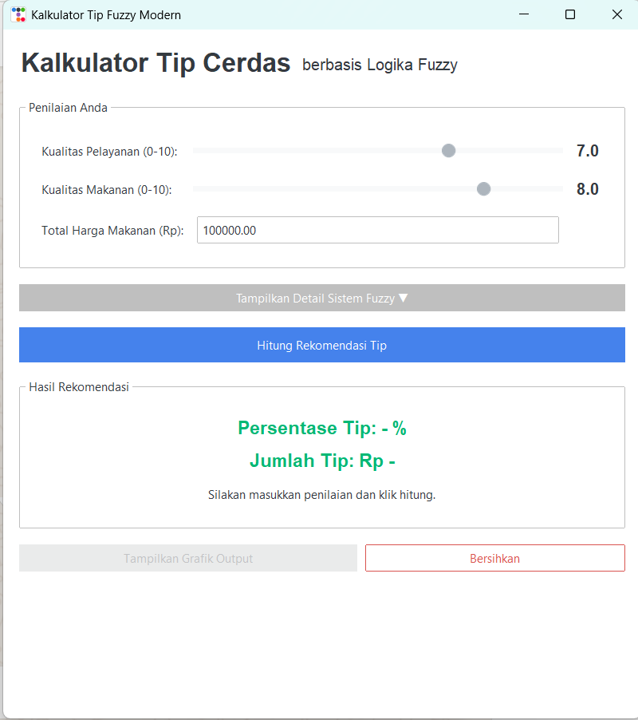

# 💡 Kalkulator Tip Cerdas Berbasis Logika Fuzzy

Ini adalah aplikasi desktop yang dikembangkan sebagai proyek untuk mata kuliah Logika Fuzzy. Aplikasi ini berfungsi sebagai kalkulator cerdas untuk merekomendasikan persentase tip di restoran berdasarkan dua input kualitatif: **Kualitas Pelayanan** dan **Kualitas Makanan**.

Inti dari aplikasi ini adalah implementasi **Sistem Inferensi Fuzzy (Fuzzy Inference System)** yang meniru cara manusia membuat keputusan dalam kondisi yang tidak pasti.

---

### ✨ Tampilan Aplikasi



---

### 🚀 Fitur Utama

-   **Rekomendasi Cerdas**: Menghasilkan persentase tip yang logis menggunakan 11 aturan fuzzy.
-   **Input Interaktif**: Pengguna dapat dengan mudah memasukkan nilai kualitas menggunakan slider.
-   **Antarmuka Modern**: Dibangun menggunakan `ttkbootstrap` dengan tema "Litera" untuk tampilan yang bersih dan profesional.
-   **Visualisasi Edukatif**:
    -   Terdapat bagian "Detail Sistem Fuzzy" yang dapat dibuka untuk melihat basis aturan dan grafik fungsi keanggotaan.
    -   Grafik fungsi keanggotaan diperbarui secara dinamis untuk menampilkan **visualisasi alpha-predicate** setelah perhitungan, membantu pengguna memahami proses fuzzifikasi.
    -   Grafik hasil akhir yang menunjukkan proses agregasi dan defuzzifikasi dapat ditampilkan di jendela terpisah.
-   **Dinamis dan Responsif**: Perhitungan dan pembaruan antarmuka terjadi secara instan setelah menekan tombol.

---

### 🔧 Teknologi dan Pustaka yang Digunakan

Proyek ini dibangun menggunakan Python 3 dengan beberapa pustaka utama:

-   **Python 3**: Sebagai bahasa pemrograman utama.
-   **scikit-fuzzy (`skfuzzy`)**: Untuk implementasi inti dari Sistem Inferensi Fuzzy.
-   **numpy**: Untuk operasi numerik, terutama dalam mendefinisikan rentang variabel fuzzy.
-   **tkinter** & **ttkbootstrap**: Untuk membangun seluruh antarmuka pengguna grafis (GUI) yang modern.
-   **matplotlib**: Untuk membuat dan menyematkan semua visualisasi data (grafik) di dalam aplikasi.

---

### ⚙️ Instalasi dan Cara Menjalankan

Untuk menjalankan aplikasi ini di komputer Anda, ikuti langkah-langkah berikut:

**1. Prasyarat**
   - Pastikan Anda sudah menginstal **Python 3** di sistem Anda.
   - Anda juga memerlukan `pip` untuk menginstal pustaka-pustaka yang dibutuhkan.

**2. Kloning Repositori**
   Buka terminal atau command prompt Anda dan jalankan perintah berikut:
   ```bash
   git clone https://github.com/HaikalFK/Pemberian-Tip-Fuzzy.git
   cd Pemberian-Tip-Fuzzy
